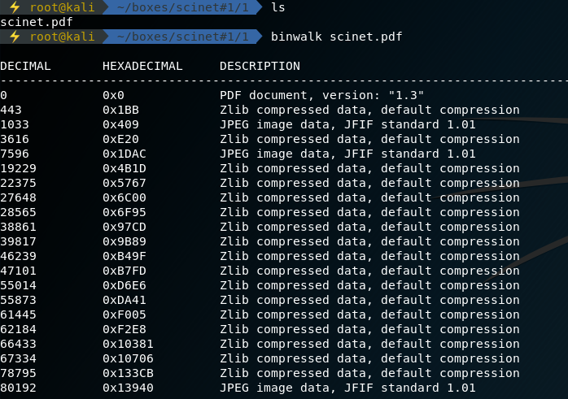
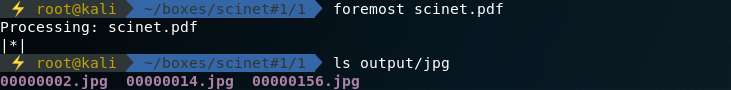
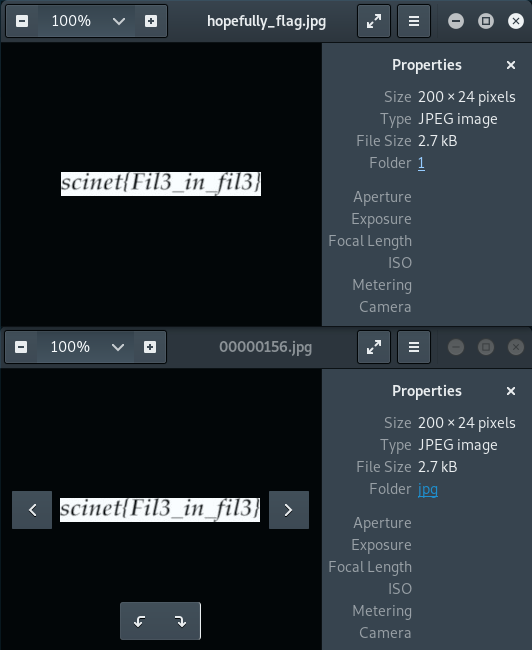

# Week One Task One

```ascii
   _____   ______    ____     __ __                  __
  / ___/  / ____/   /  _/  __/ // /_   ____   ___   / /_
  \__ \  / /        / /   /_  _  __/  / __ \ / _ \ / __/
 ___/ / / /___    _/ /   /_  _  __/  / / / //  __// /_
/____/  \____/   /___/    /_//_/    /_/ /_/ \___/ \__/

 _       __     _ __          __  __
| |     / /____(_) /____     / / / /___
| | /| / / ___/ / __/ _ \   / / / / __ \
| |/ |/ / /  / / /_/  __/  / /_/ / /_/ /
|__/|__/_/  /_/\__/\___/   \____/ .___/
                               /_/
```

## **Synopsis**

1. Odnalezienie pliku .jpeg w pdfie
2. Wyodrębnienie flagi

### **Recon**

Zaczynamy prostą steganografią. Otrzymujemy plik .pdf, po szybkiej inspekcji można stwierdzić, że flagi nie widać 'na' pliku.

Enum powinniśmy rozpocząć od użycia `file`, co okaże się jednak niepotrzebne ponieważ plik jest prawidłowym PDFem. Idąc dalej używamy `binwalk`'a, który od razu zdradza nam, że dokument zawiera dodatkowe, doklejone pliki jpeg i pokazuje ich offset od początku.



### **Solving**

JPEGi można wyciągnąć na wiele sposobów, 3 przykłady:

- `foremost`
- `dd`
- `hexdump`/`xxd`

#### foremost

Użycie `foremost` jest nieco wygodniejsze i bardziej automatyczne niż zabawa z dd/hexem, nie każdy mógł jednak znać to narzędzie.



Zaletą tego podejścia, jest to że wyciągnięte zostaną wszystkie pliki nawet te które manualnie mogliśmy pominąć.

#### dd

`dd` nie zostało do końca stworzone do celów do których je wykorzystamy, jednak to podejście działa i również nie jest skomplikowane.

Do dd należy podstawić offset otrzymany z binwalka:


Opis parametrów:

- **if** - input file
- **of** - output file
- **bs** - block size
- **skip** - blok od którego dd ma zacząć pracę (podany dziesiątkowo)

#### xxd

TODO:

### **Results**



## **Contributing**

Jeżeli zauważyłeś/aś błąd lub chcesz dodać swoją wersję rozwiązania - proszę o pull request :)
