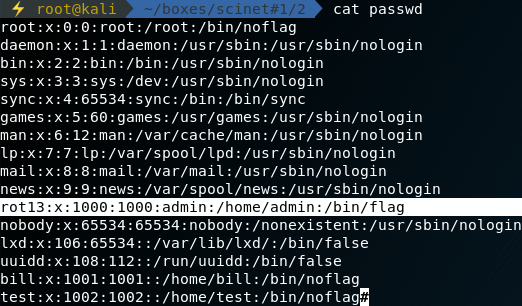
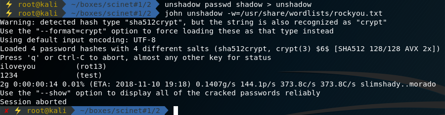

# Week 1 Task 2

```ascii
   _____   ______    ____     __ __                  __
  / ___/  / ____/   /  _/  __/ // /_   ____   ___   / /_
  \__ \  / /        / /   /_  _  __/  / __ \ / _ \ / __/
 ___/ / / /___    _/ /   /_  _  __/  / / / //  __// /_
/____/  \____/   /___/    /_//_/    /_/ /_/ \___/ \__/

 _       __     _ __          __  __
| |     / /____(_) /____     / / / /___
| | /| / / ___/ / __/ _ \   / / / / __ \
| |/ |/ / /  / / /_/  __/  / /_/ / /_/ /
|__/|__/_/  /_/\__/\___/   \____/ .___/
                               /_/
```

## **Synopsis**

1. Analiza shadow i passwd
2. Szukanie hashu
3. Logowanie do telnetu

### **Recon**

W tym zadaniu na start otrzymujemy pliki `shadow` oraz `passwd` a także adres serweru logowania. Od razu nasuwa się możliwość zcrackowania hasła.

Pierwszym etapem powinno być przejrzenie passwd:



Zauważamy dziwne shelle, jeden z nich wygląda nieco bardziej obiecująco - `/bin/flag`.

Hashe możemy spróbować rozhashować kilkoma narzędziami, najpopularniejsze to:

- John The Ripper
- Hashcat

### **Solving**

#### John

Zaczynamy od zpreparowania pliku unshadow, którego oczekuje john. Wykonujemy to poleceniem `unshadow` podając passwd oraz shadow jako arugmenty, zapisując do dowolnego pliku, w tym przypadku 'unshadow'.

Następnie rozpoczynamy atak z użyciem wordlisty, w tym przypadku `rockyou`, nie jest to jednak stricte wymagane ponieważ john domyślnie używa nieco mniejszej, wbudowanej wordlisty.



#### Hashcat

TODO:

Rozbicie hashu zajmuje sekundy, po otrzymaniu hasła możemy podłączyć się telnetem do serwera logowania, gdzie po wprowadzeniu prawidłowego hasła otrzymamy flagę.

## **Contributing**

Jeżeli zauważyłeś/aś błąd lub chcesz dodać swoją wersję rozwiązania - proszę o pull request :)
