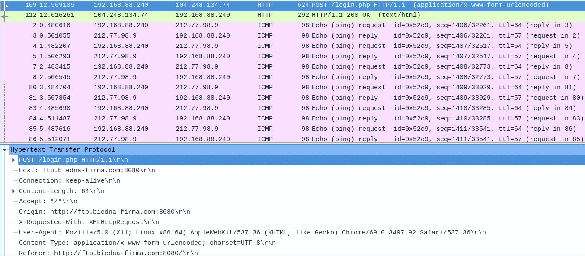
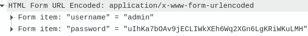
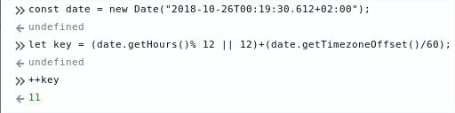
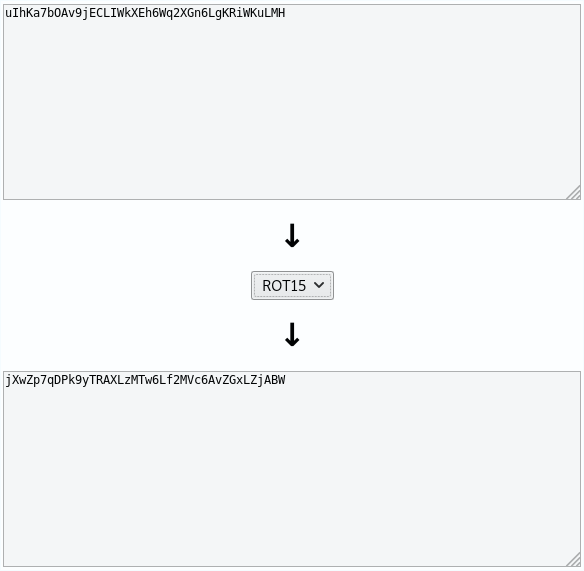
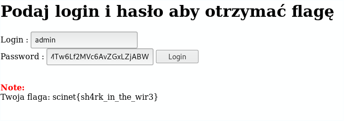

# Week 1 Task 3

```ascii
   _____   ______    ____     __ __                  __
  / ___/  / ____/   /  _/  __/ // /_   ____   ___   / /_
  \__ \  / /        / /   /_  _  __/  / __ \ / _ \ / __/
 ___/ / / /___    _/ /   /_  _  __/  / / / //  __// /_
/____/  \____/   /___/    /_//_/    /_/ /_/ \___/ \__/

 _       __     _ __          __  __
| |     / /____(_) /____     / / / /___
| | /| / / ___/ / __/ _ \   / / / / __ \
| |/ |/ / /  / / /_/  __/  / /_/ / /_/ /
|__/|__/_/  /_/\__/\___/   \____/ .___/
                               /_/
```

## **Synopsis**

1. Przekształcenie .pcap
2. Analiza .pcap
3. Analiza systemu logowania
4. Obliczanie klucza
5. Deszyfrowanie hasła

### **Recon**

Rozpoczynamy od próby otworzenia pliku wiresharkiem, która kończy się niepowodzeniem. Szybkie `file` mówi nam, że w rzeczywistości mamy do czynienia z archiwum tar które należy odpakować.

W wiresharku poszukiwanie powinniśmy rozpocząć od requestów HTTP ponieważ są one w stanie dać nam najwięcej informacji. `POST` do `login.php` zdecydowanie powinien przykuć naszą uwagę.



Otrzymujemy w ten sposób URL: `http://ftp.biedna-firma.com:8080/login.php`

Alternatywnie, mogliśmy do tego etapu dojść podstawową enumeracją nmapem oraz dowolnym dirbusterem. Takim sposobem nie otrzymujemy jednak danych logowania, wymaganych do rozwiązania zadania.



### **Solving**

#### Analiza

Przechodząc na stronę widzimy formularz logowania. Możemy użyć burpa do przeanalizowania requestów jednak do tak prostego formularza, wystarczą devtools w przeglądarce.

Naszą uwagę powinien zwrócić plik `login.js`:

```js
function caesarShift(text, shift) {
  var result = "";
  for (var i = 0; i < text.length; i++) {
    var c = text.charCodeAt(i);
    if (65 <= c && c <= 90)
      result += String.fromCharCode(((c - 65 + shift) % 26) + 65);
    // Uppercase
    else if (97 <= c && c <= 122)
      result += String.fromCharCode(((c - 97 + shift) % 26) + 97);
    // Lowercase
    else result += text.charAt(i);
  }
  return result;
}

function validate() {
  var username = document.getElementById("username").value;
  var password = document.getElementById("password").value;
  var date = new Date();
  var ofset = date.getTimezoneOffset() / 60;
  var key = (date.getHours() % 12 || 12) + date.getTimezoneOffset() / 60;

  if (key < 0) {
    key = key + 12;
  }
  if (key > 12) {
    key = key - 12;
  }
  key = key + 1;
  hashpass = caesarShift(password, key);

  $.post("login.php", { username: username, password: hashpass }, function(
    response
  ) {
    $("#flag").html(response);
  });
}
```

Podsumowując działanie kodu: wysyła on `POST` request do strony logowania z hasłem zaszyfrowanym ROTn (czy też szyfrem Cezara), z n zależnym od godziny logowania.

#### Odszyfrowywanie

Mając tę informację, powinniśmy zdeszyfrować hasło które otrzymaliśmy w wiresharku używająć godziny otrzymania pakietu, którą również tam znajdziemy.


Należy jednak uważać na strefę czasową! **(CEST/CET)**



Nie jest to jednak koniec, ponieważ hasło zostało zaszyfrowane ROT11, aby je odszyfrować należy przesunąć znaki w drugą stronę: `26-11=15` tak więc do odszyfrowania musimy zastosować ROT15:



### **Results**

Tak otrzymane hasło użytkownika `admin` po użyciu da nam flagę.



## Contributing

Jeżeli zauważyłeś/aś błąd lub chcesz dodać swoją wersję rozwiązania - proszę o pull request :)
