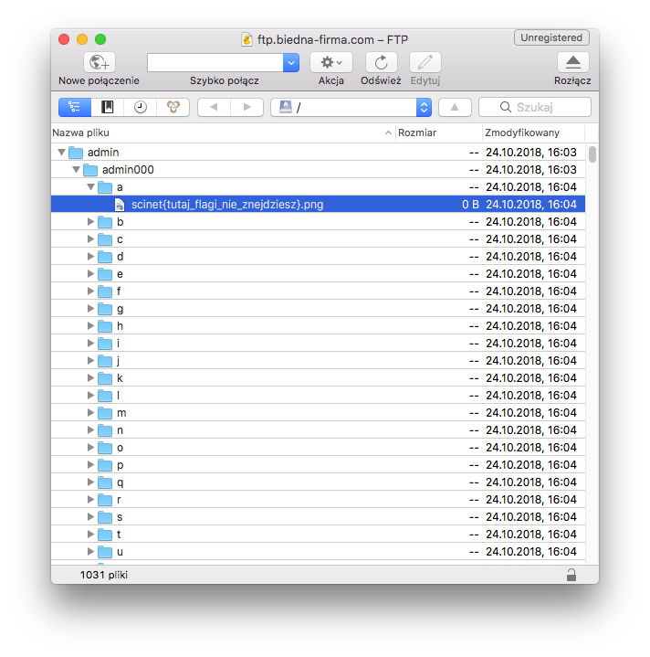
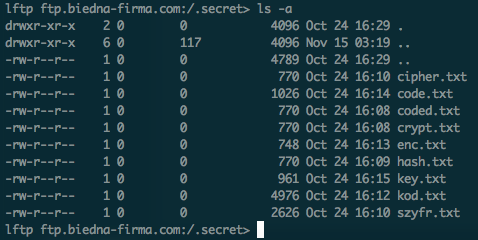

# Week 2 Task 1

```ascii
   _____   ______    ____     __ __                  __
  / ___/  / ____/   /  _/  __/ // /_   ____   ___   / /_
  \__ \  / /        / /   /_  _  __/  / __ \ / _ \ / __/
 ___/ / / /___    _/ /   /_  _  __/  / / / //  __// /_
/____/  \____/   /___/    /_//_/    /_/ /_/ \___/ \__/

 _       __     _ __          __  __
| |     / /____(_) /____     / / / /___
| | /| / / ___/ / __/ _ \   / / / / __ \
| |/ |/ / /  / / /_/  __/  / /_/ / /_/ /
|__/|__/_/  /_/\__/\___/   \____/ .___/
                               /_/
```

### **Synopsis**

1. Analiza zawartości serwera FTP
2. Rozpakowanie archiwów
3. Szukanie poprawnego loginu/hasła
4. Odszyfrowanie flagi

### **Recon**

W tym zadaniu otrzymujemy tylko adres serwera FTP.  
Po zalogowaniu (jako anonimowy użytkownik) i pobraniu listy katalogów widać 3 główne katalogi, "admin", "flagi" oraz "test". Każdy z nich zawiera dużą liczbę podkatalogów, lecz żaden z nich nie zawiera flagi.  



Przy użyciu klienta FTP który pokazuje ukryte pliki i katalogi możemy zobaczyć też ukryty katalog ".secret", który zawiera kilka plików .txt oraz jeden plik o intrygującej nazwie `..        `.



### **Solving**

#### .secret/\*.txt

Pliki .txt okazują się być pułapką, bowiem są to po prostu przekształcone przykładowe teksty (Lorem ipsum), kolejno:
```
cipher.txt: vigenere (klucz - "cryptii")
code.txt:   base64
coded.txt:  szyfr cezara (shift = 7)
crypt.txt:  szyfr cezara (shift = 9)
enc.txt:    enigma (domyślne ustawienia z cryptii.com)
hash.txt:   rot13
key.txt:    ASCII85
kod.txt:    niemiecka wersja alfabetu fonetycznego
szyfr.txt:  kod morse'a
```

#### Archiwum w archiwum

Kluczem do rozwiązania zagadki jest tu plik `..        `, który mógłby umknąć wielu osobom, jako że pojawiał się bezpośrednio pod katalogiem nadrzędnym.

Po sprawdzeniu pliku przez `file` okazuje się, że jest to archiwum zip, które należy wypakować. Niestety, w archiwum jest kolejne archiwum, tym razem formatu tar. Powtarza się to kilkanaście razy z różnymi formatami archiwów, aż dojdziemy do końcowego pliku, który na pierwszy rzut oka zawiera pary loginów i haseł.

```
sparsit:Q2VBY0M4OGRlWTd5eUpUNAo=
tiffey:dTRmRVd6R0RHUnhaRTdEYgo=
berinthia:cmhtQ2p4WHFQYmVDekhRZgo=
allan:UGs3SGZDQmViVzVld0hOeAo=
charlotte:WWM1Z3RVMlg5bXpZOGtrUAo=
potatoes:ajNOSnJFbnFVdllqZU5BTgo=
monks:N0U3bVVQZGtkUWhaeXZVaAo=
carton:Y25McE1VZXR4RTk5Wnl0TQo=
marquis:VjRBcFZ0REJoQ25hQXhyWAo=
jones:WlF1czNBRnBHZUxheEV4awo=
fizkin:ZDNndkNremduTG1BZHBaRQo=
bodgers:c0RRTUxHdDlqMnA0c0Y4bgo=
misses:cTZzblp6YzNWUGVwNUJwTQo=
dibabs:VG1ucTlZYldxNUhZaDREdwo=
miggs:c0FTYUVrcTJWUDJZWUZ3Mwo=
brass:dkxFa0tVbWhFdHJyOFM3eAo=
piper:azdoTHNLS2Q5d1RDR1dhWgo=
fogg:YnZZYlpwUm1KN1NnenZ5ego=
melia:SkZqVTRMZHd4Z3NFU0h0Uwo=
spyers:TnpqS3R0UWdLZ3ZoRG5icgo=
scadder:dUJUelBrVVpQUWJ0Q3o4ZQo=
vengeance:bVlnN3pXZGFnclQzUlhqego=
micawber:M0U5VUIzTU42dHF5ajYyego=
wilkins:d1pCSkNFTjl5ZkI2V3hTOAo=
toby:dG5ENjU2TnpHNFhmR1F3WQo=
lavinia:SExQN2JuVFc3djVOSnY3UQo=
granger:NlUzZlNiY0h5TVFtUWRIQgo=
thomas:RXVZeFZhQ3FDbmFIdUtqago=
cousin:OU5RTkJtMzlNOEFRWlNyWgo=
chick:MkpjbThhZUp2dXBjZEJNcQo=
biddy:eVVTVGc1QmZwUmdZeXNNcQo=
jobling:S1ZtN0FISGhqS3p6NGFaZAo=
joram:ODZtVHVaZEp3QVg1Y3VEVwo=
gabelle:dUxjTWh5THozQkF0OEp3Qgo=
native:VXVoQ1h1TW43UDRxNGhFVQo=
ghost:ZUU1aFZuNFN3VUx4MnBDeQo=
nipper:dUZRdEFka1Q2ZGIzTnFtQQo=
jellyby:S0JEa0g2ZUVZc3AyUVFGYgo=
fleming:Umh2M3prcjJTQnJiN0U0Ywo=
coiler:ajZYUjdnRk02Z3Y2VVNuawo=
parkes:S0pVYVZldTlCWFNxRVcyYgo=
claypole:ajN6c3c1c1F2cnpRUVNhTgo=
dingo:SjN4dnpMdFJSQ0ZkcU5Rdgo=
quinion:YXVwZGJjOEZ2VTVoM0RZTQo=
corney:dHk1djM5QVA2VXU0Z0p3eAo=
milly:anhkcFlYZlBCMld4QWJiQwo=
stephen:UG1QNjhaSHFtTEx3bVdqNgo=
compeyson:WWZMOUFQRkUzREZhM3U4dQo=
hawkins:aDZqYnlrbTlHeUFqeFNVcAo=
chuckster:Wm1hckt4NktnZjhjUFBNbQo=
```

**Po zamianie z Base64:**

```
sparsit:CeAcC88deY7yyJT4
tiffey:u4fEWzGDGRxZE7Db
berinthia:rhmCjxXqPbeCzHQf
allan:Pk7HfCBebW5ewHNx
charlotte:Yc5gtU2X9mzY8kkP
potatoes:j3NJrEnqUvYjeNAN
monks:7E7mUPdkdQhZyvUh
carton:cnLpMUetxE99ZytM
marquis:V4ApVtDBhCnaAxrX
jones:ZQus3AFpGeLaxExk
fizkin:d3gvCkzgnLmAdpZE
bodgers:sDQMLGt9j2p4sF8n
misses:q6snZzc3VPep5BpM
dibabs:Tmnq9YbWq5HYh4Dw
miggs:sASaEkq2VP2YYFw3
brass:vLEkKUmhEtrr8S7x
piper:k7hLsKKd9wTCGWaZ
fogg:bvYbZpRmJ7Sgzvyz
melia:JFjU4LdwxgsESHtS
spyers:NzjKttQgKgvhDnbr
scadder:uBTzPkUZPQbtCz8e
vengeance:mYg7zWdagrT3RXjz
micawber:3E9UB3MN6tqyj62z
wilkins:wZBJCEN9yfB6WxS8
toby:tnD656NzG4XfGQwY
lavinia:HLP7bnTW7v5NJv7Q
granger:6U3fSbcHyMQmQdHB
thomas:EuYxVaCqCnaHuKjj
cousin:9NQNBm39M8AQZSrZ
chick:2Jcm8aeJvupcdBMq
biddy:yUSTg5BfpRgYysMq
jobling:KVm7AHHhjKzz4aZd
joram:86mTuZdJwAX5cuDW
gabelle:uLcMhyLz3BAt8JwB
native:UuhCXuMn7P4q4hEU
ghost:eE5hVn4SwULx2pCy
nipper:uFQtAdkT6db3NqmA
jellyby:KBDkH6eEYsp2QQFb
fleming:Rhv3zkr2SBrb7E4c
coiler:j6XR7gFM6gv6USnk
parkes:KJUaVeu9BXSqEW2b
claypole:j3zsw5sQvrzQQSaN
dingo:J3xvzLtRRCFdqNQv
quinion:aupdbc8FvU5h3DYM
corney:ty5v39AP6Uu4gJwx
milly:jxdpYXfPB2WxAbbC
stephen:PmP68ZHqmLLwmWj6
compeyson:YfL9APFE3DFa3u8u
hawkins:h6jbykm9GyAjxSUp
chuckster:ZmarKx6Kgf8cPPMm
```

#### Bruteforce FTP

Każde hasło wydaje się losowym ciągiem znaków, lecz są na tej liście jedne prawidłowe dane, które umożliwiają logowanie.  
Do sprawdzenia tak dużej ilości loginów i haseł można użyć `paralell`, który dla każdego wiersza pliku wykona określoną komendę (w tym przypadku, logowanie na serwer FTP).  

```
$ cat passwd.txt | parallel -k --bar -j32 echo "ls" | lftp -u $1 ftp.biedna-firma.com
```

Po kilku sekundach otrzymujemy listing z jedynego poprawnego konta, `ghost`. (brak zrzutu ekranu, ponieważ w chwili pisania write-upa konto było nieaktywne)  
Znajdują się tam: plik `ghost.txt` o zawartości "GhostProtectGuard" oraz dwa foldery - flag, zawierający plik `AUX` oraz keys z plikiem `secring.gpg`.  
Uruchomienie `file` na pliku `AUX` zdradza, że jest to plik zaszyfrowany przez klucz PGP:

```
$ file AUX
AUX: PGP RSA encrypted session key - keyid: A6DFAD5B BC6D6C56 RSA (Encrypt or Sign) 2048b .
```

#### Odszyfrowanie wiadomości

Zaimportowanie klucza GPG do systemu oraz uruchomienie `gpg --decrypt AUX` pokazuje zaszyfrowaną flagę.

```
$ gpg --decrypt AUX
gpg: zaszyfrowano 2048-bitowym kluczem RSA o identyfikatorze 5BADDFA6566C6DBC, stworzonym 2018-10-24
      ,,ghost''
scinet{F1l3_TR4nSf3R_Pr0t0c0L}
```

## Contributing

Jeżeli zauważyłeś/aś błąd lub chcesz dodać swoją wersję rozwiązania - proszę o pull request :)
