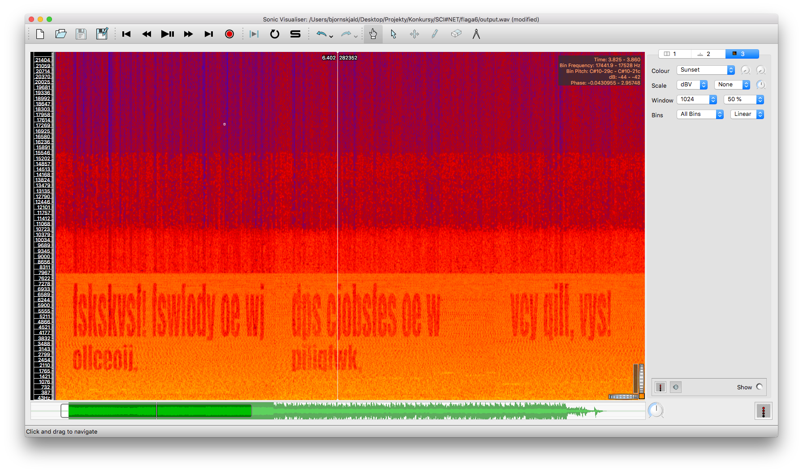
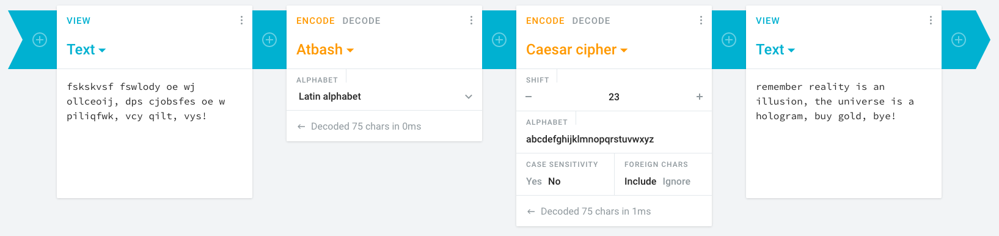
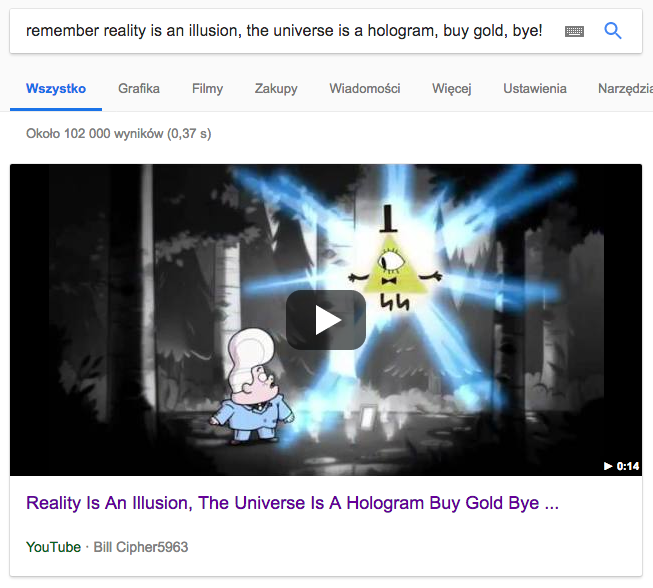
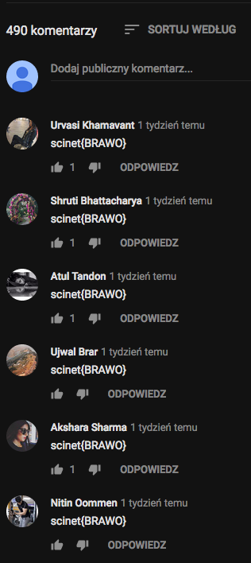

# Week 2 Task 3

```ascii
   _____   ______    ____     __ __                  __
  / ___/  / ____/   /  _/  __/ // /_   ____   ___   / /_
  \__ \  / /        / /   /_  _  __/  / __ \ / _ \ / __/
 ___/ / / /___    _/ /   /_  _  __/  / / / //  __// /_
/____/  \____/   /___/    /_//_/    /_/ /_/ \___/ \__/

 _       __     _ __          __  __
| |     / /____(_) /____     / / / /___
| | /| / / ___/ / __/ _ \   / / / / __ \
| |/ |/ / /  / / /_/  __/  / /_/ / /_/ /
|__/|__/_/  /_/\__/\___/   \____/ .___/
                               /_/
```

### **Synopsis**

1. Obejrzenie filmu
2. Analiza spektrogramu
3. Odszyfrowanie ukrytego tekstu
4. Szukanie rozwiązania na YouTube

### **Recon**

Do tego zadania dostajemy plik o ciekawej nazwie `zvarpensg_zbqr_cnpxntr.mp4` (rot13 `minecraft_mode_package`).  
Po obejrzeniu filmu można wyciągnąć 2 wnioski:
- Dźwięk z początku filmu brzmi fatalnie, prawdopodobnie coś jest w nim ukryte
- Przez cały film słychać motyw z Wodogrzmotów Małych, co może być wskazówką.

### **Solving**

#### Spektrogram

Co do dźwięku, oczywiste jest sprawdzenie spektrogramu, aby znaleźć jakąkolwiek ukrytą wiadomość. Do tego możemy użyć [Sonic Visualizera](https://www.sonicvisualiser.org/), który jest darmowy i dosyć prosty w obsłudze.

Możemy wyciągnąć dźwięk z filmu przy użyciu ffmpeg:
```
$ ffmpeg -i zvarpensg_zbqr_cnpxntr.mp4 -vn -acodec copy output.aac
```
oraz przekonwertować otrzymany plik na `.wav` obsługiwany przez Sonica:
```
$ ffmpeg -i output.aac output.wav
```

Otworzenie pliku, włączenie podglądu spektrogramu (`Pane -> Add Spectrogram -> All Channels Mixed`) oraz ustawienie odpowiednich barw (`Colour: Sunset`) ujawnia ukryty tekst:



```
fskskvsf fswlody oe wj ollceoij, dps cjobsfes oe w piliqfwk, vcy qilt, vys!
```

#### Odszyfrowanie tekstu

Z pomocą Google oraz drugiej wskazówki możemy znaleźć [post na reddicie](https://www.reddit.com/r/gravityfalls/comments/2whdi6/), który wskazuje na użycie atbasha i szyfru cezara:

*FSKSKVSF is an atbash cipher for UHPHPEHU which is then in turn a Caesar cipher for REMEMBER*

W ten sposób poznajemy prawdziwe znaczenie tekstu:



```
remember reality is an illusion, the universe is a hologram, buy gold, bye!
```

#### Film na YouTube

Szukając tej frazy w Google znajdujemy jako pierwszy wynik wyszukiwania [film](https://www.youtube.com/watch?v=ny59kjNfuZA) o identycznej nazwie:



### **Results**

Teraz wystarczy tylko posortować komentarze od najnowszych i naszym oczom pokaże się rozwiązanie całej zagadki - flaga.



## Contributing

Jeżeli zauważyłeś/aś błąd lub chcesz dodać swoją wersję rozwiązania - proszę o pull request :)
